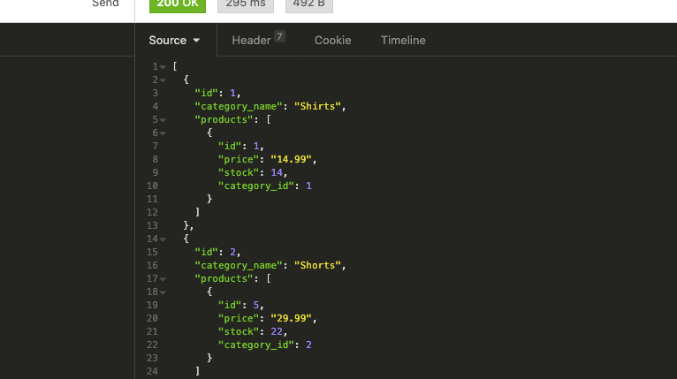
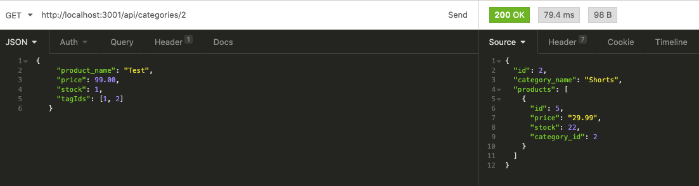
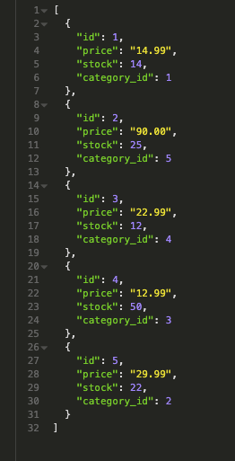

# ecommerce-backend
I have successfully completed all requirements.
All routes retrieve required data including additional data.
You can add, update, and delete data.
Code is well organized.
There really isn't much to say in this readme.md...

# Screen Shots

